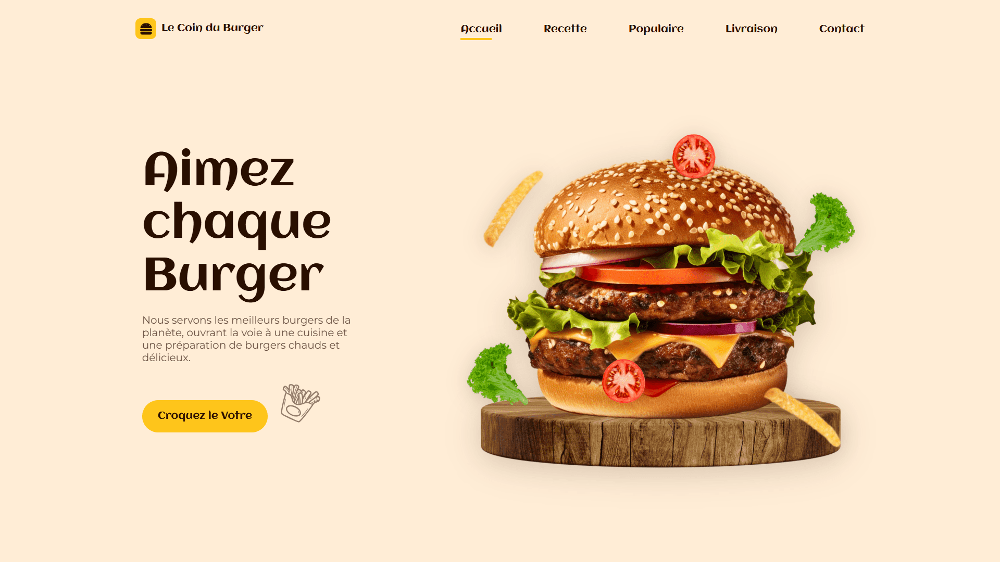

<div align="center">  
    <a href="https://burger-restaurant-vm.netlify.app/" target="_blank">  
        
    </a>
    </br>  
    </br>  
  <h3 align="center">🍔 Le Coin du Burger  &nbsp; — &nbsp; Restaurant Moderne</h3>  
</div>

## <br /> 📌 Sommaire

&nbsp;&nbsp;&nbsp; 🎨 &nbsp; [**Introduction**](#introduction)<br />
&nbsp;&nbsp;&nbsp; 🛠️ &nbsp; [**Technologies**](#technologies)<br />
&nbsp;&nbsp;&nbsp; 🎯 &nbsp; [**Fonctionnalités**](#fonctionnalités)<br />
&nbsp;&nbsp;&nbsp; 🚀 &nbsp; [**Installation**](#installation)<br />

## <br /> <a name="introduction">🎨 Introduction</a>

Le Coin du Burger est une landing page moderne et immersive pour un restaurant de burgers, développée en HTML, CSS et JavaScript. Elle combine visuels appétissants, animations fluides via ScrollReveal.js et navigation dynamique. Chaque section met en avant les recettes, produits populaires, composition des burgers, livraison rapide et contact. Parfait pour un fast-food ou un projet vitrine dans le secteur culinaire.

## <br /> <a name="technologies">🛠️ Technologies</a>

- HTML5 sémantique et structuration claire
- CSS3 moderne avec variables, media queries et animations
- JavaScript ES6 clair et modulaire
- [ScrollReveal](https://scrollrevealjs.org/) pour des animations d’entrée synchronisées
- [Remix Icons](https://remixicon.com/) pour des icônes vectorielles modernes
- Responsive Design pensé en mobile-first

## <br /> <a name="fonctionnalités">🎯 Fonctionnalités</a>

- Section Accueil avec slogan animé et ingrédients flottants
- Présentation de la recette maison par ingrédient
- Catalogue des burgers populaires avec prix et bouton d’ajout
- Bloc Livraison rapide avec call-to-action
- Section Contact complète : localisation, numéros, messageries
- Menu responsive avec ouverture et fermeture mobile
- Navigation fluide avec liens actifs au scroll
- Bouton de retour en haut dynamique
- Design sur mesure avec palette gourmande et typographie food
- Code HTML/CSS/JS propre, maintenable et sans dépendances

## <br /> <a name="installation">🚀 Installation</a>

### ✅ Prérequis

- [Google Chrome](https://www.google.com/) &nbsp;—&nbsp; Navigateur moderne
- [Visual Studio Code](https://code.visualstudio.com/) &nbsp;—&nbsp; Éditeur de code
- [Live Server](https://marketplace.visualstudio.com/items?itemName=ritwickdey.LiveServer) &nbsp;—&nbsp; Extension VS Code

### 📥 Cloner le projet

```bash
git clone git@github.com:ValentinMadiot/burger-restaurant_ui
cd burger-restaurant_ui
```

### ▶️ Lancer le projet

Il suffit d’ouvrir le fichier `index.html` dans un navigateur, ou d’utiliser l’extension **Live Server** sur VS Code pour un aperçu dynamique.
